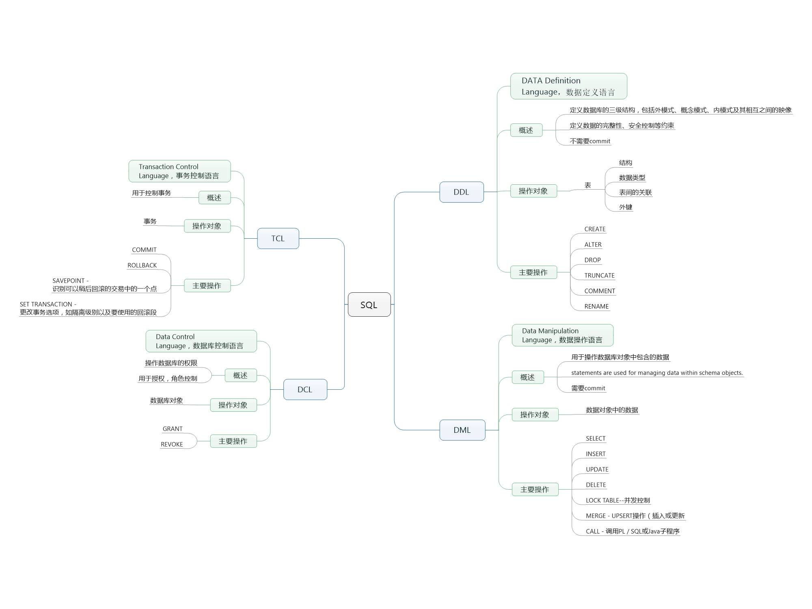

# MySQL 基础

## 1、概述

MySQL目前属于Oracle，分成`社区版和企业版`，`关系型数据库`。

### 1.1 目录结构

|编号|目录|说明|
|:-:|:-:|:-:|
|1|bin|存储可执行文件|
|2|data|存储数据文件|
|3|doc|文档|
|4|include|存储包含头文件|
|5|lib|存储库文件|
|6|share|错误消息和字符集|

配置文件：`my.ini`

### 1.2 启动和停止服务

|编号|指令|说明|
|:-:|:-:|:-:|
|1|`net start/stop mysql`|在win cmd中使用来启动和停止mysql服务|

### 1.3 登入和登出

|编号|指令|说明|
|:-:|:-:|:-:|
|1|`mysql -uuer_name -ppassword -Pport -hhost`|用于登录，可以只使用`mysql -uuser_name -ppasswrod`来开启，后面的可以使用默认的值。`-P`是指端口号，默认3306。`-h`是指地址，默认127.0.0.1|
|2|`exit`, `quit`和`\q`之中任意一个即可|用于登出|

### 1.4 修改输入提示符

|编号|指令|说明|
|:-:|:-:|:-:|
|1|`mysql -prompt`|在登入时，通过`-prompt`来指定提示符|
|2|`prompt`|在处于命令行时使用`prompt`来指定|

在指定提示符的时候可以使用`\D`, `\d`, `\h`和`\u`来指示提示符显示当前的日期、数据库、服务器和用户。

### 1.5 查询数据库信息

|编号|指令|说明|
|:-:|:-:|:-:|
|1|`SELECT VERSION()`|当前的数据库版本|
|2|`SELECT NOW()`|当前的数据库时间|
|3|`SELECT USER()`|当前的数据库操作用户|
|4|`SELECT DATABASE()`|当前操作的数据库|

### 1.6 注释

|编号|指令|说明|
|:-:|:-:|:-:|
|1|`--`|行注释|
|2|`/**/`|多行注释|

### 1.7 约定

数据库操作指令大写；数据库相关的名称小写，且单词之间用下划线分开。

### 1.8 字符编码

|编号|指令|说明|
|:-:|:-:|:-:|
|1|`show variables like 'char%`|查看mysql中当前编码|
|2|`show create table <表名>`|查看数据表的编码格式|
|3|`create database <数据库名> character set utf8`|创建数据库时指定数据库的字符集|
|4|`create table tb_books (...) default charset = utf8;`|创建数据表时指定数据表的编码格式|
|5|`alter database <数据库名> character set utf8`|修改数据库的编码格式|
|6|`alter table <表名> character set utf8`|修改数据表格编码格式|
|7|`alter table <表名> change <字段名> <字段名> <类型> character set utf8`|修改字段编码格式|
|8|`set names gbk`|连接之后使用该命令解决Windows命令行中中文乱码问题| 

### 1.9 SQL类型

## 2、数据库操作

### 2.1 创建

    CREATE {DATABASE | SCHEMA} [IF NOT EXISTS] db_name 
    [DEFAULT] CHARACTER SET [=] character_name

说明:

|编号|说明|
|:-:|:-:|
|1|DEFAULT用来说明使用默认编码方式。默认编码方式通过配置文件`my.ini`中的`default-character-set`中指定|
|2|`CHARACTER SET [=] character_name`用来指定数据库的字符编码方式|
|3|有了`IF NOT EXISTS`当指定数据库已经存在的时候，就不会报错了，否则会报错，但是报的错还是可以查找到的|

建立表的时候使用备注：

    CREATE TABLE test_table (
        test_grade int DEFAULT 1 COMMENT '等级'
    ) COMMENT = '测试表';

### 2.2 其他语句

|编号|指令|说明|
|:-:|:-:|:-:|
|1|SHOW CREATE DATABASE db_name|显示创建数据库的SQL语句，类似的，还有显示表的创建的SQL语句`SHOW CREATE TABLE tbl_name`|
|2|ALTER {DATABASE&#124;SCHEMA} [DEFAULT] CHARACTER SET [=] charset_name|修改数据库的字符编码方式的语句|
|3|DROP {DATABASE&#124;SCHEMA} [IF EXISTS] db_name||
|4|SHOW DATABASES|显示当前所有数据库，类似的，有`SHOW TABLES [FROM db_name]`用于显示当前数据库（或指定数据库）下面的所有表|

## 3、数据类型

### 3.1 整型

整数分为有符号和无符号的，通过`UNSIGNED`指定。（取值范围和C语言一样）

|编号|类型|长度|
|:-:|:-:|:-:|
|1|TiNYINT|1字节|
|2|SMALLINT|2字节|
|3|MEDIUMINT|3字节|
|4|INT|4字节|
|5|BIGINT|8字节|

### 3.2 浮点型

浮点数也分为有符号的和无符号的。如下所示，前面的m指定了总的位数，后面的n指定了小数的位数，所以整数位数为m-n. 和C语言中的float和double范围一样。

|编号|类型|长度|
|:-:|:-:|:-:|
|1|FLOAT[(m,n)]||
|2|DOUBLE[(m,n)]||
|3|DECIMAL[(m,n)]|适用于高精度要求的场景|

### 3.3 时间类型

|编号|类型|长度|
|:-:|:-:|:-:|
|1|YEAR|1字节，格式YYYY，范围1901-2155，零值0000|
|2|TIME|3字节，格式HH:MM:SS，范围-838:59:59-838:59:59，零值00:00:00|
|3|DATE|4字节，格式YYYY-MM-DD，范围1000-01-01-9999-12-31，零值0000-00-00|
|4|DATETIME|8字节，格式YYYY-MM-DD HH:MM:SS，范围1000-01-01 00:00:00-9999-12-31 23:59:59，零值0000-00-00 00:00:00|
|5|TIMESTAMP|4字节，格式YYYY-MM-DD HH:MM:SS，范围19700101080001-2038年的某个时刻，零值00000000000000|

或者使用时间戳，用BIGINT保存指定时间的毫秒值。

### 3.4 字符型

|编号|类型|长度|
|:-:|:-:|:-:|
|1|CHAR(m)|m字节，0<=m<=255|
|2|VARCHAR(m)|L+1字节，L<=m<=65535|
|3|TINYTEXT|L+1字节，L<28|
|4|TEXT|L+2字节，L<216|
|5|MEDIUMEXT|L+3字节，L<224|
|6|LONGTEXT|L+4字节，L<232|
|7|ENUM('val1', 'val2', ...)|枚举类型，取决于枚举个数，最多65535|
|8|SET('val1', 'val2', ...)|主要用于对枚举进行组合选择|

## 4、数据表的操作

### 4.1 创建数据表

    CREATE TABLE [IF NOT EXISTS] table_name (
        column_name data_type, 
        ...
    );
	
相关SQL

|编号|指令|说明|
|:-:|:-:|:-:|
|1|SHOW TABLES [FROM db_name][LIKE 'pattern'&#124;WHERE expr]|查看指定数据库的所有的表|
|2|SHOW COLUMNS FROM tbl_name|显示指定表的各个列的定义|

### 4.2 约束

|编号|约束|说明|
|:-:|:-:|:-:|
|1|列的空和非空|在创建表的时候，在定义列的后面加上`NOT NULL`来指定指定的列不可为空。这样的列在插入记录的时候必须对其进行赋值|
|2|自增|自动编号，必须与主键组合使用。通过在创建表的时候在列定义后加入`AUTO_INCREMENT`来实现。此外，可以通过`ALTER TABLE users AUTO_INCREMENT = 10000;`来指定自增的开始值|
|3|主键|必须保证唯一性，一个表只能有一个，非NULL。创建表的时候使用`PRIMARY KEY`来指定列是主键|
|4|唯一约束|必须保证唯一性，一个表可以有多个，可以是NULL的。创建表的时候使用`UNIQUE KEY`来指定列是唯一的|
|5|默认约束|当指定的列没有指定值的时候就使用默认的值，在创建表的时候，通过使用`DEFAULT`关键字来指定列的默认值|
|6|外键约束|在实际开发过程中更多地使用逻辑外键而不是物理外键，就是只要保证表之间的关联关系就好，而不为表设置外键。因为外键要求创建表的时候，父表和子表都必须使用INNODB引擎|

### 4.3 修改表

#### 4.3.1 基本操作

|编号|指令|说明|
|:-:|:-:|:-:|
|1|ALTER TABLE tbl_name ADD [COLUMN] col_name col_def [FIRST&#124;AFTER col_name]|添加单列，向指定的表中加入一列。通过`FIRST`指定新加入的列处于所有列的最前方，通过`AFTER col_name`指定新加入的列相对于某个列的位置|
|2|ALTER TABLE tbl_name ADD [COLUMN] (col_name col_def[, col_name col_def, ...])|添加多个列，当向表中添加多个列的时候，只能将新加入列放在表的最后面的位置|
|3|ALTER TABLE tbl_name DROP [COLUMN] col_name[, col_name, ...]|删除列，可以指定并删除多个列|
|4|ALTER TABLE tbl_name RENAME [TO&#124;AS] new_tbl_name|修改表名|
|5|RENAME TABLE tbl_anem TO new_tbl_name [, tbl_name TO new_tbl_name...]|修改表名|

#### 4.3.2 约束操作

|编号|指令|说明|
|:-:|:-:|:-:|
|1|`ALTER TABLE tbl_name ADD [CONSTRAINT[symbol]] PRIMARY KEY [index_type](index_col_name)`|添加主键约束|
|2|`ALTER TABLE tbl_name ADD [CONSTRAINT[symbol]] UNIQUE [index_type](index_col_name)`|添加唯一约束|
|3|`ALTER TABLE tbl_name DROP PRIMARY KEY`|删除主键约束|
|4|`ALTER TABLE DROP {INDEX|KEY} col_name`|删除索引|

1和2两条语句分别用来向指定的表中的列加入主键和唯一性约束。示例`ALTER TABLE temp ADD UNIQUE(name)`（列名上要加括号）。
加入了主键和唯一性约束的同时会为指定的列加上索引，所以可以使用`index_type`来指定索引的类型。
要为MySQL设置默认的索引，到`my.ini`中的`default-storage-engine`中进行设置即可。另外，可以使用`SHOW INDEXES FROM tbl_name`查看指定表中存在的索引。

#### 4.3.2 修改表定义

    ALTER TABLE tbl_name MODIFY [COLUMN] col_name col_def [FIRST|AFTER col_name]

上面这种方式可以修改列的定义语句，它适用的范围比较广——可以通过在col_def中指定约束和数据类型来对列进行更多的修改。

    ALTER TABLE tbl_name CHANGE [COLUMN] old_col_name new_col_name col_def [FIRST|AFTER col_name]

上面的修改语句的适用范围更广，它可以修改的范围包括：列的数据类型、约束、位置和名称。

#### 4.3.3 增加索引

|编号|指令|说明|
|:-:|:-:|:-:|
|1|`ALTER TABLE tbl_name ADD PRIMARY KEY (col_name)`|主键索引, 添加PRIMARY KEY|
|2|`ALTER TABLE tbl_name ADD UNIQUE (col_name)`|唯一索引, 添加UNIQUE|
|3|`ALTER TABLE ADD key(col_name)`以及`ALTER TABLE tbl_name ADD INDEX index_name (col_name)`|普通索引, 添加INDEX|
|4|`ALTER TABLE tbl_name ADD FULLTEXT (col_name)`|全文索引, 添加FULLTEXT|
|5|`ALTER TABLE tbl_name ADD INDEX index_name (col_name1, col_name2, ..)`|多列索引|

## 5、插入操作

向表中插入数据的时候，常用的SQL语句有下面三种：

1. 向指定数据库的指定列中插入数据，如果不指定了列的名称，就必须对表的所有的列进行赋值:

        INSERT [INTO] tbl_name [(col_name, ...)] {VALUES|VALUE} ({expr|DEFAULT}, ...), (...), ...

2. 可以为指定的列指定值，可以使用表达式，也可以使用默认值：

        INSERT [INTO] tbl_name SET col_name = {expr|DEFAULT} [, col_name = {expr|DEFAULT}]

3. 将查询结果插入到指定的表中，比如`INSERT INTO temp (name) SELECT name FROM assignment`，格式：

        INSERT [INTO] tbl_name [(col_name, ...)] SELECT ...

## 6、更新操作

    UPDATE [LOW_PRIORITY] [IGNORE] table_reference 
    SET col_name1 = {expr|DEFAULT} [, col_name2 = {expr|DEFAULT}] ... 
    [WHERE where_condition]

没有指定WHERE语句，就对整个表的全部记录进行更新。

## 7、删除操作

    DELETE FROM tbl_name [WHERE where_condition]

## 8、查找

	SELECT select_expr [, select_expr ...] 
	[
		FROM table_references
		[WHERE where_condition]
		[GROUP BY {col_name|position} [ASC|DESC], ... ]
		[HAVING having_condition]
		[ORDER BY {col_name|expr|position} [ASC|DESC], ...]
		[LIMIT {[offset,] row_count | row_count OFFSET offset}]
	]

### 8.1 查找不同值

将`DISTINCT`关键字放在指定的列前面，用于检索指定的列的不同的值。比如，`select count(distinct cust_id) from orders;`。

`DISTINCT`作用于所有的列，而不是其后的那一列。比如，`select count(distinct cust_id, order_num) from orders;`将搜索出cust_id不同并且order_num不同的列。

### 8.2 限制结果集、分页

    select * from orders limit 2 offerset 2;  
    select * from orders limit 2 , 2;

类似于上面这样，前面的数字2表示查询的数目条数，后面的2表示从哪个位置开始。所以，上面的效果是查询第2条和第3条数据。但是，要注意的是数据库中条的编号的起始位置是0。如果不指定第二个2将查出所有数据中前两个记录。

### 8.3 排序结果集

使用`ORDER BY`语句。可以指定多个列进行排序，可以为要排序的列指定排序的方向，使用`ASC`表示增序排列，使用`DESC`表示降序排列。默认，升序排列。除了使用列名来指定要排序的列，害可以使用列的在查询的所有列中的位置来指定排序的列。

`DESC`只应用到直接位于其前面的列，如果要为多个列进行降序，就应该每个列后面加上`DESC`。

### 8.4 过滤结果集

#### 8.4.1 WEHER子句操作符

|编号|操作符|说明|
|:-:|:-:|:-:|
|1|`=`|等于 |
|2|`<>`和`!=`|不等于|
|3|`<`和`<=`|小于和小于等于 |
|4|`>`和`>=`|大于和大于等于|
|5|`IS NULL`|为NULL值|
|6|`BETWEEN`|处于两者之间，示例：`SELECT * FROM orders WHERE order_num BETWEEN 20006 AND 30000`|

#### 8.4.2 AND和OR操作符

使用AND和OR操作符的时候要注意优先级是`AND>OR`。比如，

    select * from orders 
    where order_num = 20006 or order_num = 200005 and cust_id = 1000000001;

会被当成

    select * from orders 
    where order_num = 20006 or (order_num = 20005 and cust_id = 1000000001);

而如果我们想要表达的意思是：

    select * from orders 
    where (order_num = 20006 or order_num = 200005) and cust_id = 1000000001;

因此就要在OR操作符上面增加圆括号。

#### 8.4.3 IN操作符

    select * from orders where order_num in (20006, 20005);  

IN操作符其实完成的操作和OR一样。

#### 8.4.4 NOT操作

    select * from orders where not order_num = 20005;

如上所示将not操作加在where条件的前面可以表示对条件的反。上面的效果就相当于`where order_num != 20005`

#### 8.4.5 exists

    select * from orders t 
    where 1 = 1 
    and exists(select * from customers where cust_id = t.cust_id);

#### 8.4.6 like

    select * from products where prod_name like '%doll';

上面的是查找所有prod_name以doll结尾的记录。还可以，比如`Fish%`用来匹配所有以Fish开头的，`F%y`用来匹配以F开头并且以y结尾的记录。

通配符%可以用来匹配除NULL意外的记录，即`WHERE prod_name like '%'`不会找出prod_name为NULL的记录。

#### 8.4.7 下划线

下划线用来匹配指定数量的字符。一个下划线匹配一个字符。

### 8.5 创建计算字段

#### 8.5.1 拼接字符串

    select concat(cust_name,':',cust_city) from customers;

如上所示，使用concat函数可以将查询结果拼接起来。

#### 8.5.2 使用别名

    select concat(cust_name,':',cust_city) as cust_city from customers;

如上所示，使用`AS`操作符来将拼接的字符串命名为cust_city.

#### 8.5.3 使用正则表达式

下面的是使用正则表达式对数据进行过滤的例子，即可以将REGEXP像like一样使用，并在REGEXP后面加上正则表达式即可。下面的表达式检索出的结果是，customers中所有cust_name中包含'Fun'的记录。

    select * from customers where cust_name REGEXP 'Fun';

下面的SQL语句用来搜索出所有prod_name开头字符包含在1,2,8之内，并且字符后面是' inch'的记录：

    select * from products where prod_name regexp '[812] inch'

### 8.6 分组数据

#### 8.6.1 分组过滤GROUP BY

    select order_num, count(order_num) from orderitems group by order_num;

使用`GROUP BY`可以对数据进行分组，上面的效果是显示出指定order_num的记录的条数。

    select t.*, sum(quantity*item_price) as total 
    from orders as t, orderitems 
    where t.order_num = orderitems.order_num 
    group by order_num;

上面的语句的执行的结果是，得到了orders表的全部数据，以及每条订单对应的总价（根据orderitems表计算得出）。但是如果没有加入Group BY语句就无法得到上面的结果。

可以使用下面的两个SQL语句的执行结果来理解GROUP BY语句的效果：

    select sum(quantity*item_price) from orderitems;
    select sum(quantity*item_price) from orderitems group by order_num;

如果没加Group BY得到的是两个列的每条记录的两个字段相乘之后的总和，使用之后得到的是针对每个order_num的两个字段相乘之后的总和。前面的只得到了一条记录，后面的得到了针对每个order_num的记录。

下面的例子也使用了GROUP语句，但是这里在分组的时候的依据不是order_num而是cust_id。这样也是可以的，它得到的结果是：各个cust_id所应该支付的账单总额。

    select sum(i.quantity*i.item_price) as total
    from orders as o, orderitems as i
    where o.order_num = i.order_num
    group by o.cust_id;

如果我们再关联一张customers表，来得到用户的名称，那么我们可以写成下面的样子：

    select c.cust_name as name, sum(i.quantity*i.item_price) as total
    from orderitems as i, orders as o, customers as c
    where i.order_num = o.order_num and c.cust_id = o.cust_id
    group by c.cust_id;

#### 8.6.2 过滤分组HAVING

    select sum(quantity * item_price) as total 
    from orderitems 
    group by order_num 
    having total > 1000;

如上所示，我们使用`HAVING`语句来对分组之后的结果进行过滤。上面是找出总价值在1000以上的分组。

### 8.7 子查询

下面的使用了子查询的语句执行的结果与上面的一样：指定名称用户的总额。

    select c.cust_name, (select sum(i.quantity*i.item_price) 
                         from orderitems as i, orders as o
                         where i.order_num = o.order_num and c.cust_id = o.cust_id 
                         group by o.cust_id) as total 
    from customers as c;

上面的这种方式是将子查询用作计算字段。

子查询的另一种是用方式是将子查询的结果放在一个IN中作为取值范围。

### 8.8 联结表

所谓的联结可以理解成按照指定的方式将两个或者多个表组合起来，形成一个类似于新的表。因为MySQL是关系型数据库，所以经常会在多个表之间存在一对多或者多对多关系，而联结的效果就是将这样的表联结起来。比如，如果两个数据库之间是一对多关系，那么肯定有些字段只存在于父表中，在查询的时候我们要将这些存在于父表中的字段与存在于子表中的字段组合起来，形成一个完整的“数据”，就应该使用联结来实现。

假如有这样的数据：

在表1中存储着：A0B0, A0B1
在表2中存储着：A0C0, A0C1, A0C2

这里的A, B, C表示的是数据库的列中存储的记录。A表示一个列中的数据，B也表示列中的数据，AB构成一个记录。

那么，如果我们对表1和表2在A上面使用联结将得到的记录如下：

B0C0, B0C1, B0C2, B1C0, B1C1, B1C2

这就相当于我们将B中的与A相关的字段补充了起来。

#### 8.8.1 等值联结

联结表的最常见的形式是使用`=`将两表的对应的字段连接起来，这叫做等值联结。

#### 8.8.2 内联结

下面是使用内联结的一个实现：

    select vend_name, prod_name
    from vendors as v inner join products as p
    on v.vend_id = p.vend_id;

内联结相当于对两个表在指定的列上面取交集，即只有两个表中都存在的字段才会进行联结。

#### 8.8.3 自联结

    select *
    from customers as c1, customers as c2
    where c1.cust_name = c2.cust_name
    and c2.cust_contact = 'Jim Jones';

上面的SQL语句的是自联结的，需要为两个相同的表分别指定一个别名。

#### 8.8.4 外联结

所谓的外联结，就是指左联结和右联结。它跟内联结不同的地方只在于，以左联结为例，如果左表中被用来指定联结的值在右表中不存在，那么也一样将左表中的记录检索出来，只是右表中指定的字段为NULL。

    select vend_name, prod_name
    from vendors as v left join products as p
    on v.vend_id = p.vend_id;

比如上面的SQL中，如果vendors中的vend_id在右表中不存在，那么prod_name作为NULL。同理，可得右联结。

联结的语法：

    LEFT [OUTER] JOIN，左外连接。
    RIGHT [OUTER] JOIN，右外连接。

这里的OUTER是可选的，有没有都行。

#### 8.8.5 组合查询UNION

    select prod_name from products
    union
    select vend_name from vendors;

使用`UNION`可以将两个分别独立的SQL查询的结果合并起来。（但是要求两个SQL检索出的列的数目要相等，其实它的效果和OR差不多）

如果查询出来的两条记录一样，重复的行会被取消，可以使用`UNION ALL`关键字来替代`UNION`，这样重复的行就不会被取消。

使用UNION组合查询的时候，只能有一条ORDER BY子句，且必须位于最后一条SELECT语句的后面。

## 9、视图

视图可以用来简化SQL操作，你可以将一次的查询结果作为一个视图，并为其添加一个名称，比如A。然后，我们可以像使用一个表一样从A中检索出数据。

视图的创建语句如下：

    create view orderdetail as
    select o.*, i.order_item, i.prod_id, i.quantity, i.item_price
    from orders as o left join orderitems as i
    on o.order_num = i.order_num;

即在一个标准的查询语句上面增加一个`create view orderdetail as`语句来创建视图。创建完毕视图之后，我们就可以像使用表一样从视图中检索数据。比如：

    select * from orderdetail order by cust_id;

## 10、存储过程

存储过程和视图相似，也是提供一种SQL复用的机制。因为本身视图只能用来将指定的数据检索出来作为数据表一样使用，它本身只能用于“查询”操作，具有一定的局限性。因此，这里有存储过程来将指定功能的SQL封装起来，使其像一个函数一样可以被调用。

存储过程的可移植性比较差，而且需要更高的技能和经验，因此通过被限制创建。

### 10.1 创建存储过程

#### 10.1.1 创建无参存储过程

在MySQL命令行中创建存储过程的示例：

    mysql> delimiter //
    mysql> create procedure mypp()
        -> begin
        -> select * from orders;
        -> end//

在这里`delimiter //`的作用是使用`//`而不是';'作为语句分隔符。

#### 10.1.2 为存储过程添加参数

MySQL支持IN（传递给存储过程）、 OUT（从存储过程传出，如这里所用）和INOUT（对存储过程传入和传出）类型的参数。

    mysql> create procedure avgprice(in num int, out price decimal(8,2))
        -> begin
        ->     select avg(item_price)
        ->     from orderitems
        ->     where order_num = num
        ->     into price;
        -> end//

上面的语句中创建了一个名为avgprice的存储过程。它接受两个参数，num是传入的参数；price是传出的参数。在存储过程内部，我们为orderitems的指定order_num为num的所有记录的平均item_price赋值非price.

创建完毕了存储过程之后，我们可以像下面这样调用以上存储过程：

    call avgprice(20009, @price);

然后，我们可以使用SELECT语句得到price的计算结果：

    select @price

### 10.2 其他SQL

|编号|指令|说明|
|:-:|:-:|:-:|
|1|`call mypp()|没有参数的存储过程的使用示例|
|2|`drop procedure mypp`|删除存储过程|
|3|`show create procedure avgprice`|检查存储过程|

## 11、游标

MySQL游标只能用于存储过程（和函数）

    mysql> create procedure copyprodname()
        -> begin
        ->     --定义局部变量，结束条件
        ->     declare done boolean default 0;
        ->     --定义局部变量，产品名称
        ->     declare name varchar(255);
        ->
        ->     --定义游标
        ->     declare names cursor
        ->     for
        ->     select prod_name from products;
        ->
        ->     --定义循环结束条件
        ->     declare continue handler for sqlstate '02000' set done = 1;
        ->
        ->     --创建表
        ->     create table if not exists prod_name(name varchar(255));
        ->
        ->     --打开游标
        ->     open names;
        ->
        ->     --定义循环
        ->     repeat
        ->     --获取游标的数据，将其填充到name中
        ->     fetch names into name;
        ->     --将游标中的数据插入到prod_name表中
        ->     insert into prod_name values(name);
        ->     --定义循环的结束条件
        ->     until done end repeat;
        ->
        ->     --结束游标
        ->     close names;
        -> end//

在上面的代码中，使用

    declare done boolean default 0;

定义了循环的条件为布尔类型，并将其默认值设置为0. 然后，使用定义了循环结束的条件

    declare continue handler for sqlstate '02000' set done = 1;

这里的'02000'是一个未找到条件， 当REPEAT由于没有更多的行供循环而不能继续时，出现这个条件。在使用游标之前，需要先打开游标。这通过SQL语句：

    open names;

来完成。当我们执行完业务逻辑之后，需要关闭游标。这通过SQL语句：

    close names;

来完成。在游标的打开和关闭的作用域内，我们通过
  
    fetch names into name;

将从游标中得到的数据填充到name中。

## 12、触发器

触发器用来在某事件发生时自动执行，有些类似于监听器的作用。它只能为delete, insert, update三种操作设置触发器。触发器可以设置在指定的操作执行之前或者之后触发。

只有表才支触发器，视图和临时表都不支持。

每个表最多设置6个触发器，且同一触发器不能与多个事件或多个表关联。

### 12.1 创建触发器

触发器创建的基本语法格式：

    CREATE TRIGGER <触发器名称>  --触发器必须有名字，最多64个字符
    { BEFORE | AFTER }  --触发器有执行的时间设置：可以设置为事件发生前或后。
    { INSERT | UPDATE | DELETE }  --触发的事件：insert、update或delete的过程中触发。
    ON <表名称>  --触发器是属于某一个表的:当在这个表上执行插入、 更新或删除操作的时候就触发。
    FOR EACH ROW  --触发器的执行间隔：FOR EACH ROW子句通知触发器 每隔一行执行一次动作，而不是对整个表执行一次。
    <触发器SQL语句>  --触发器包含所要触发的SQL语句：这里的语句可以是任何合法的语句， 包括复合语句，但是这里的语句受的限制和函数的一样。

触发器的使用示例：

    mysql> create trigger watcher after insert on prod_name
        -> for each row
        -> begin
        ->     insert into prod_name_copy values(new.name);
        -> end//

上面的触发器监听prod_name表的插入操作，每当向表prod_name中插入一条记录的同时向prod_name_copy也插入一条记录。

**insert触发器**代码内，可以引用一个名为new的虚拟表，访问被插入的行。

**delete触发器**代码内，可以引用一个名为old的虚拟表，访问被删除的行。

**update触发器**代码内，可以使用一个名为old的虚拟表，访问更新之前的数据，使用名为new的虚拟表，访问更新的值。

### 12.2 删除触发器

    DROP TRIGGER 触发器名称：

## 13、事务管理

事务保证了一系列操作的原子性，只有当执行过程中没有产生错误，并且提交了之后才会将执行的结果反应到数据库上。如果使用了回滚操作将回复到开始事务之前的状态。

MySQL中的数据库引擎分别支持不同类型的事务。

#### 13.1 基本的事务操作

|编号|指令|说明|
|:-:|:-:|:-:|
|1|START TRANSACTION|开始事务|
|2|ROLLBACK|回滚事务|
|3|COMMIT|提交事务|
|4|SET autocommit = 0|修改默认提交行为，设置不自动提交|

### 13.2 创建保留点

可以使用语句
   
    SAVEPOINT 名称;

来创建保留点。在准备回滚的时候，我们可以使用

    ROLLBACK TO 名称;

来回滚到指定的保留点。这样指定保留点之前的操作不会回滚，而保留点之后的操作将全部被会滚。

通常，保留点越多越好。当提交或者回滚之后，保留点会被自动释放。此外，也可以使用`RELEASE`来主动释放保留点。

## 14、安全管理

在MySQL的数据库中存在一个mysql库，那里面的user表用于存储MySQL的用户。

    create user shouheng identified by 'psd';

上面的SQL用来MySQL中添加一个用户。如果要对用户进行重命名，可以使用：

    rename user little_boy to shouheng;

如果删除用户可以使用：

    drop user username;

查看授予用户的权限：

    show grants for shouheng;

授予权限：

    grant select on sql_test_db.* to shouheng;

以上操作用来将sql_test_db的所有数据的只读权限授予指定用户。如果要回收指定用户的权限，可以使用

     revoke select on sql_test_db.* from shouheng;

它表示回收指定用户对sql_test_db的只读权限。

除了上面示例的只读权限以外，MySQL还允许为新加入的用户指定其他权限。

为指定的用户修改密码：

     set password for shouheng = Password('psd');
